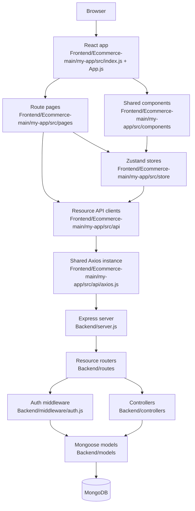

<!-- generated-by: gsd-doc-writer -->
# Architecture

## System Overview

PLASHOE is a split ecommerce application made of a Create React App frontend in `Frontend/Ecommerce-main/my-app` and an Express/Mongoose backend in `Backend`. The frontend renders product browsing, cart, account, checkout, contact, and order-tracking screens; it sends JSON API requests through resource-specific Axios clients. The backend exposes `/api/*` resource routers, applies JWT authentication and admin authorization where needed, coordinates ecommerce workflows in controllers, and persists users, products, carts, orders, coupons, and contact messages in MongoDB through Mongoose models.

## Component Diagram



## Runtime Entry Points

| Area | Entry point | Responsibility |
| --- | --- | --- |
| Backend API server | `Backend/server.js` | Loads runtime configuration with `dotenv`, connects MongoDB, applies CORS and JSON middleware, mounts API routers, exposes `/api/health`, installs the final error handler, and listens on `PORT` or `5000`. |
| Backend database connector | `Backend/config/db.js` | Opens the Mongoose connection from `MONGO_URI` and logs connection errors while allowing the app process to continue. |
| Backend seed script | `Backend/utils/seedData.js` | Seeds users, products, and coupons through backend models when run with `npm run seed` from `Backend`. |
| Frontend bootstrap | `Frontend/Ecommerce-main/my-app/src/index.js` | Creates the React root, renders `App` inside `React.StrictMode`, and starts web-vitals reporting. |
| Frontend route shell | `Frontend/Ecommerce-main/my-app/src/App.js` | Configures Material UI theme, React Router routes, protected checkout/order pages, shared layout nesting, and global toast behavior. |
| Frontend HTTP client | `Frontend/Ecommerce-main/my-app/src/api/axios.js` | Uses `config.api.baseUrl`, adds bearer tokens from `useAuthStore`, and logs the user out on `401` responses. |

## Layers

| Layer | Location | Role |
| --- | --- | --- |
| Frontend application shell | `Frontend/Ecommerce-main/my-app/src/index.js`, `Frontend/Ecommerce-main/my-app/src/App.js` | Browser bootstrap, routing, theme setup, route protection, and toast setup. |
| Frontend pages | `Frontend/Ecommerce-main/my-app/src/pages/*.jsx` | Route-level screens such as `Home`, `Men`, `Women`, `Collection`, `Sale`, `Cart`, `Checkout`, `Account`, `Contact`, `LookBook`, `OurStory`, and `OrderDetail`. |
| Frontend components | `Frontend/Ecommerce-main/my-app/src/components/*.jsx` | Reusable UI and layout pieces including `Layout`, `Header`, `Footer`, `ProductGrid`, `ProductCard`, `CartSidebar`, `QuickViewModal`, `ProtectedRoute`, and `TrackingTimeline`. |
| Frontend API clients | `Frontend/Ecommerce-main/my-app/src/api/*.js` | Resource-specific wrappers for auth, products, cart, orders, contact, and coupon calls. |
| Frontend state | `Frontend/Ecommerce-main/my-app/src/store/*.js` | Persisted auth and cart state with Zustand, plus cart selectors for item count, subtotal, and total. |
| Backend HTTP shell | `Backend/server.js` | Express app setup, middleware, route mounting, health check, and process-level listening. |
| Backend routes | `Backend/routes/*.js` | HTTP method/path declarations for auth, products, cart, orders, coupons, and contact messages. |
| Backend middleware | `Backend/middleware/auth.js` | JWT bearer-token verification through `protect` and admin-only authorization through `admin`. |
| Backend controllers | `Backend/controllers/*.js` | Request validation, domain workflow orchestration, model calls, status codes, and JSON response shaping. |
| Backend models | `Backend/models/*.js` | Mongoose schemas and persistence behavior for `User`, `Product`, `Cart`, `Order`, `Coupon`, and `ContactMessage`. |

## API Boundaries

All backend routes are mounted from `Backend/server.js` under the `/api` prefix:

| Resource | Backend mount | Frontend client | Access pattern |
| --- | --- | --- | --- |
| Auth | `/api/auth` | `Frontend/Ecommerce-main/my-app/src/api/authApi.js` | Register and login are public; profile, current user, and address mutations use `protect`. |
| Products | `/api/products` | `Frontend/Ecommerce-main/my-app/src/api/productsApi.js` | Product listings and detail routes are public; create, update, and delete use `protect` plus `admin`. |
| Cart | `/api/cart` | `Frontend/Ecommerce-main/my-app/src/api/cartApi.js` | The router applies `router.use(protect)`, so all backend cart routes require a valid bearer token. |
| Orders | `/api/orders` | `Frontend/Ecommerce-main/my-app/src/api/ordersApi.js` | The router applies `router.use(protect)`, so order creation, listing, detail, and cancellation are authenticated. |
| Coupons | `/api/coupons` | `Frontend/Ecommerce-main/my-app/src/api/ordersApi.js` exports `couponApi` | Coupon validation is public; coupon listing, creation, and deletion use `protect` plus `admin`. |
| Contact | `/api/contact` | `Frontend/Ecommerce-main/my-app/src/api/ordersApi.js` exports `contactApi` | Contact submission is public; message listing, read marking, and deletion use `protect` plus `admin`. |
| Health | `/api/health` | No dedicated frontend client detected | Returns a basic JSON health response from `Backend/server.js`. |

The frontend does not call backend URLs directly from page components for the core resources. Pages and stores call resource API modules, those modules reuse `Frontend/Ecommerce-main/my-app/src/api/axios.js`, and that shared Axios instance centralizes the base URL, JSON headers, bearer-token injection, and `401` logout behavior.

## Data Flow

### Product Browsing

1. A public route in `Frontend/Ecommerce-main/my-app/src/App.js` renders a page such as `Home`, `Collection`, `Men`, `Women`, or `Sale`.
2. The page uses product UI components from `Frontend/Ecommerce-main/my-app/src/components`, such as `ProductGrid` and `ProductCard`.
3. Product data requests go through `Frontend/Ecommerce-main/my-app/src/api/productsApi.js`, which calls relative paths such as `/products`, `/products/men`, `/products/women`, `/products/sale`, `/products/bestsellers`, and `/products/categories`.
4. `Frontend/Ecommerce-main/my-app/src/api/axios.js` sends the request to `config.api.baseUrl`, which defaults to `http://localhost:5000/api` when `REACT_APP_API_URL` is not set.
5. `Backend/server.js` receives the request under `/api/products` and forwards it to `Backend/routes/productRoutes.js`.
6. `Backend/routes/productRoutes.js` maps the path to `Backend/controllers/productController.js`.
7. The controller queries `Backend/models/Product.js` and returns JSON to the client.

### Authentication

1. `Frontend/Ecommerce-main/my-app/src/pages/Account.jsx` calls actions from `useAuthStore` in `Frontend/Ecommerce-main/my-app/src/store/authStore.js`.
2. `Frontend/Ecommerce-main/my-app/src/store/authStore.js` calls `authApi.register`, `authApi.login`, `authApi.getMe`, `authApi.updateProfile`, `authApi.addAddress`, or `authApi.deleteAddress`.
3. `Frontend/Ecommerce-main/my-app/src/api/authApi.js` uses the shared Axios instance to call `/auth/*` endpoints.
4. `Backend/routes/authRoutes.js` sends public registration and login requests to `Backend/controllers/authController.js`; protected profile and address routes pass through `protect`.
5. `Backend/controllers/authController.js` creates or verifies users with `Backend/models/User.js`, signs JWTs with `JWT_SECRET`, and returns user data with the token.
6. `Frontend/Ecommerce-main/my-app/src/store/authStore.js` persists `token`, `user`, and `isAuthenticated` under the `auth-storage` key.

### Cart and Checkout

1. Cart UI and checkout screens use `useCartStore` from `Frontend/Ecommerce-main/my-app/src/store/cartStore.js`.
2. Guest cart changes stay in the persisted Zustand cart store and use local item IDs.
3. Authenticated cart changes call `cartApi`, which sends requests to `/cart`, `/cart/items`, `/cart/items/:itemId`, and `/cart/coupon`.
4. `Backend/routes/cartRoutes.js` applies `router.use(protect)` before all cart handlers.
5. `protect` verifies the bearer JWT, loads the user from `Backend/models/User.js`, and attaches `req.user`.
6. `Backend/controllers/cartController.js` creates, loads, mutates, clears, or discounts a `Cart` document through `Backend/models/Cart.js`.
7. During checkout, `Frontend/Ecommerce-main/my-app/src/pages/Checkout.jsx` creates an order through `ordersApi.create`.
8. `Backend/controllers/orderController.js` creates an `Order`, increments coupon usage when applicable, clears the cart, and returns the created order.

### Order Tracking

1. `Frontend/Ecommerce-main/my-app/src/pages/OrderDetail.jsx` is only reachable through `ProtectedRoute`.
2. The frontend calls `ordersApi.getById(id)` or `ordersApi.cancel(id)`.
3. `Backend/routes/orderRoutes.js` protects all order routes before calling `Backend/controllers/orderController.js`.
4. `Backend/models/Order.js` stores status, order number, shipping method, carrier, tracking number, timestamps, and `trackingHistory`.
5. UI components such as `TrackingTimeline.jsx` can render order status from the returned order data.

### Contact and Coupons

1. Contact submission goes through `contactApi.submit`, exported from `Frontend/Ecommerce-main/my-app/src/api/ordersApi.js`, and reaches the public `POST /api/contact` route.
2. Contact administration routes are guarded by both `protect` and `admin`.
3. Coupon validation goes through `couponApi.validate` and reaches public `POST /api/coupons/validate`.
4. Coupon administration routes are guarded by both `protect` and `admin`.

## State Ownership

| State | Owner | Persistence |
| --- | --- | --- |
| Users, products, carts, orders, coupons, contact messages | MongoDB through `Backend/models/*.js` | Database-backed Mongoose documents. |
| Auth token and current user | `Frontend/Ecommerce-main/my-app/src/store/authStore.js` | Zustand `persist` storage under `auth-storage`. |
| Cart items, coupon code, discount | `Frontend/Ecommerce-main/my-app/src/store/cartStore.js` | Zustand `persist` storage under `cart-storage`; authenticated users synchronize cart data with the backend. |
| Cart drawer open/closed state | `Frontend/Ecommerce-main/my-app/src/store/cartStore.js` | In-memory Zustand state. |
| Route state | React Router in `Frontend/Ecommerce-main/my-app/src/App.js` and `Frontend/Ecommerce-main/my-app/src/components/ProtectedRoute.jsx` | Browser navigation state; unauthenticated protected-route users are redirected to `/account` with the attempted location. |
| API base URL and frontend constants | `Frontend/Ecommerce-main/my-app/src/config/config.js` | Runtime values from `REACT_APP_*` variables with source-defined defaults. |

## Key Abstractions

| Abstraction | Location | Description |
| --- | --- | --- |
| Express app | `Backend/server.js` | Central HTTP composition point for middleware, router mounts, health checks, and error handling. |
| `connectDB` | `Backend/config/db.js` | Mongoose connection helper used once at backend startup. |
| Resource routers | `Backend/routes/*.js` | Small routing modules that bind HTTP paths to controller exports and apply `protect` or `admin` where required. |
| `protect` middleware | `Backend/middleware/auth.js` | Extracts `Authorization: Bearer <token>`, verifies it with `JWT_SECRET`, loads the user, and sets `req.user`. |
| `admin` middleware | `Backend/middleware/auth.js` | Allows only authenticated users with `isAdmin` to continue. |
| Controllers | `Backend/controllers/*.js` | Async request handlers for auth, product, cart, order, coupon, and contact workflows. |
| Mongoose models | `Backend/models/*.js` | Schema definitions and model-level behavior, including password hashing in `User` and order-number generation in `Order`. |
| Shared Axios instance | `Frontend/Ecommerce-main/my-app/src/api/axios.js` | Single HTTP client for backend calls, token attachment, and unauthorized-response handling. |
| Resource API modules | `Frontend/Ecommerce-main/my-app/src/api/*.js` | Stable frontend boundary for calling backend resources from pages and stores. |
| `useAuthStore` | `Frontend/Ecommerce-main/my-app/src/store/authStore.js` | Auth state, login/register/profile actions, logout, and user fetch behavior. |
| `useCartStore` | `Frontend/Ecommerce-main/my-app/src/store/cartStore.js` | Cart sidebar state, guest cart behavior, authenticated cart synchronization, coupon application, and cart selectors. |
| `ProtectedRoute` | `Frontend/Ecommerce-main/my-app/src/components/ProtectedRoute.jsx` | Frontend route guard that redirects unauthenticated users to `/account`. |

## Directory Structure Rationale

```text
PLASHOE/
├── Backend/
│   ├── config/        # Runtime integration configuration, currently MongoDB connection setup.
│   ├── controllers/   # API use cases and response shaping.
│   ├── middleware/    # Cross-route Express middleware for auth and authorization.
│   ├── models/        # Mongoose schemas and persistence rules.
│   ├── routes/        # HTTP resource boundaries mounted by server.js.
│   ├── utils/         # Operational backend scripts such as data seeding.
│   ├── package.json   # Backend package metadata, ES module mode, and npm scripts.
│   └── server.js      # Backend API entry point.
└── Frontend/
    └── Ecommerce-main/
        └── my-app/
            ├── public/       # CRA HTML shell and public static assets.
            ├── src/
            │   ├── api/      # Backend API clients and shared Axios instance.
            │   ├── assets/   # Imported media used by React code.
            │   ├── components/ # Reusable UI, layout, route guard, cart, product, and tracking widgets.
            │   ├── config/   # Frontend configuration facade for REACT_APP_* values.
            │   ├── pages/    # Route-level screens rendered by React Router.
            │   └── store/    # Shared auth and cart state.
            ├── package.json  # Frontend package metadata and CRA scripts.
            └── tailwind.config.js # Tailwind content and theme configuration.
```

The backend uses a conventional Express MVC split: route files describe HTTP shape, controllers own request behavior, and models own persistence structure. The frontend uses a route/page/component split: route pages compose screens, shared components keep reusable UI outside page files, API modules isolate backend integration, and Zustand stores handle state that must survive route changes or reloads.

## Architectural Constraints

- The backend package is ES module based because `Backend/package.json` sets `"type": "module"`; backend relative imports use `.js` file extensions.
- The backend is a single Express process using the Node.js event loop. No worker process, queue consumer, scheduler, or background job framework is detected.
- The MongoDB connection is attempted at startup, but `connectDB` logs failures instead of exiting. Features that depend on Mongoose models may fail later if the database is unavailable.
- CORS is configured in `Backend/server.js` with `credentials: true` and an origin from `FRONTEND_URL`, defaulting to `http://localhost:5173`.
- The frontend API base URL is centralized in `Frontend/Ecommerce-main/my-app/src/config/config.js` and defaults to `http://localhost:5000/api`.
- `Frontend/Ecommerce-main/my-app/src/api/axios.js` imports `useAuthStore`, while `Frontend/Ecommerce-main/my-app/src/store/authStore.js` imports `authApi`, which uses the shared Axios instance. Changes to auth initialization or interceptor behavior should be made carefully because the auth store and HTTP client are tightly coupled.
- Authenticated cart behavior and guest cart behavior intentionally diverge: authenticated users synchronize with `/api/cart`, while guests use local persisted cart items with `local-*` IDs.
- Admin authorization is enforced only where routes explicitly include `admin`; new backend mutation routes must add `protect` and `admin` deliberately when they should be restricted.
- The frontend contains public static product/image assets under `Frontend/Ecommerce-main/my-app/public/database`, but core product API clients are pointed at the backend `/products` endpoints.
- Runtime configuration values are read from environment variables in code, but this document does not rely on or quote local `.env` file contents.

## Change Guidance

- Add a new backend resource by creating a model in `Backend/models`, controller functions in `Backend/controllers`, a router in `Backend/routes`, and a mount in `Backend/server.js`.
- Add a new frontend backend call by extending or adding a resource module under `Frontend/Ecommerce-main/my-app/src/api`; keep pages and components on the API module boundary instead of constructing raw Axios calls.
- Add cross-route frontend state in `Frontend/Ecommerce-main/my-app/src/store` only when multiple screens/components need it or it must persist across reloads; keep one-screen UI state inside the owning page/component.
- Add protected frontend pages by wrapping their route element in `ProtectedRoute` in `Frontend/Ecommerce-main/my-app/src/App.js` and by enforcing authorization again on the backend route.
- Keep persistent domain rules in Mongoose models when they belong to document lifecycle or schema shape, and keep request-specific orchestration in controllers.
